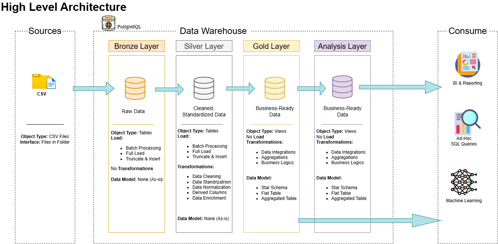

# 📦 Brazilian E-Commerce ETL Pipeline (Olist Dataset)

## 📌 Overview

This project implements an end-to-end **ETL pipeline (Extract, Transform, Load)** using the Brazilian E-Commerce Public Dataset provided by Olist.

The pipeline is built using **Databricks** and version-controlled with **GitHub**.

It transforms raw e-commerce data into structured, analytics-ready datasets for **business intelligence and machine learning applications**.

---

## 🎯 Objectives

- Build a scalable ETL pipeline using real-world e-commerce data  
- Apply data cleaning, validation, and transformation rules  
- Implement Medallion Architecture (Bronze → Silver → Gold)  
- Introduce an **Analysis Layer for BI and ML readiness**  
- Enable dashboards and machine learning workflows  

---

## 🧱 Architecture



---

## 📂 Project Structure
```
Brazilian_E_Commerce_ETL_Pipeline/
│
├── dashboards/                               #Databricks interactive dashboards as .html files
│
├── docs/                               # Project documentation and architecture details
│   ├── diagrams/
│     ├── data_flow.drawio              # Draw.io file for the data flow diagram
│     ├── star_schema_erd.drawio                    # Draw.io file for data models (star schema)   
│     ├── high_level_architecture.drawio        # Draw.io file shows the project's architecture
│     ├── integration_model.drawio              # Draw.io how tables are related
│     ├── integration_model.drawio              # Draw.io how tables are related
│   ├── data/                          # Raw datasets used for the project (.CSV data)
│   ├── images/                          # Images of dashboards
│   ├── dashboards/                          # Notebooks for creating dashboards
│
├── scripts/                            # SQL & Python scripts for ETL and transformations
│   ├── bronze/                         # Scripts for extracting and loading raw data
│   ├── silver/                         # Scripts for cleaning and transforming data
│   ├── gold/                           # Scripts for creating analytical models
│   ├── analysis/                          
│   ├── ml/                         
│   ├── dashboards/                          
│
├── etl/                              #ETL Pipline from Databricks as different file formats
│   ├── Pipeline/                           
│     ├── ETL_Pipeline.py                                  
│   ├── Pipeline.yaml                           
│
├── README.md                           # Project overview and instructions
```

---

## 🛠️ Tech Stack

- Databricks (Spark / SQL / Python)
- Delta Lake
- Python
- SQL
- GitHub version control
- Kaggle Olist Dataset

---

## 📊 Dataset

The dataset contains real Brazilian e-commerce data:

- Customers  
- Orders  
- Order Items  
- Payments  
- Products  
- Sellers  
- Reviews  
- Geolocation  

Source: Olist Brazilian E-Commerce Public Dataset (Kaggle)

---

## ⚙️ ETL Pipeline Breakdown

### 🥉 Bronze Layer
- Raw ingestion of CSV files  
- No transformations applied  
- Source-of-truth data layer  

### 🥈 Silver Layer
- Data cleaning and standardization  
- Null handling and deduplication  
- Text normalization (case, trimming, accents)  
- Business rule validation  

### 🥇 Gold Layer
- Business-ready datasets  
- Aggregated KPIs and metrics  
- Analytics-ready data models  

### 🟣 Analysis Layer
- Semantic consumption layer built on Gold  
- Used for:
  - 📊 Dashboards / BI tools  
  - 🤖 Machine Learning models  
- Feature engineering and analytical views  

---

## 📈 Data Consumption Flow

Both **Gold Layer** and **Analysis Layer** support downstream use cases:

- 📊 Business Intelligence dashboards  
- 📊 Reporting and analytics  
- 🤖 Machine Learning models  

---

## 📊 Dashboards

Dashboards are stored in:

/docs/dashboards

Includes:

- Sales performance analysis  
- Customer behavior insights  
- Delivery performance metrics  
- Product category trends  
- Revenue breakdown  

---

## 🖼️ Architecture & Visuals

/docs/diagrams  
/docs/images  

---

## 🚀 How to Run

1. Clone repository:
git clone https://github.com/KevinPOR/Brazilian_E_Commerce_ETL_Pipeline.git

2. Open in Databricks Repos

3. Run ETL layers in order:
Bronze → Silver → Gold → Analysis

4. Execute pipeline:
pipeline/ETL_Pipeline.py

---

## ⚙️ Environment & Limitations

This project was developed using the **free edition of Databricks**.

Due to free-tier limitations:

- No production-grade orchestration (Jobs / Workflows)
- No autoscaling or advanced scheduling features
- No ML model serving or managed feature store

### 🔮 Future Improvements (Require Paid/External Tools)

- Full pipeline orchestration (Databricks Jobs)
- CI/CD integration with GitHub
- Real-time ingestion pipelines
- ML model deployment and serving layer

---

## 📌 Key Features

- End-to-end ETL pipeline  
- Medallion architecture implementation  
- Analysis layer for ML + BI readiness  
- Data cleaning and validation rules  
- Deduplication and transformation logic  
- Production-style data engineering structure  
- Git-based version control workflow  

---

## 👨‍💻 Author

Karim Kousa (KevinPOR)  
Data Engineering Project — Olist E-Commerce Dataset
